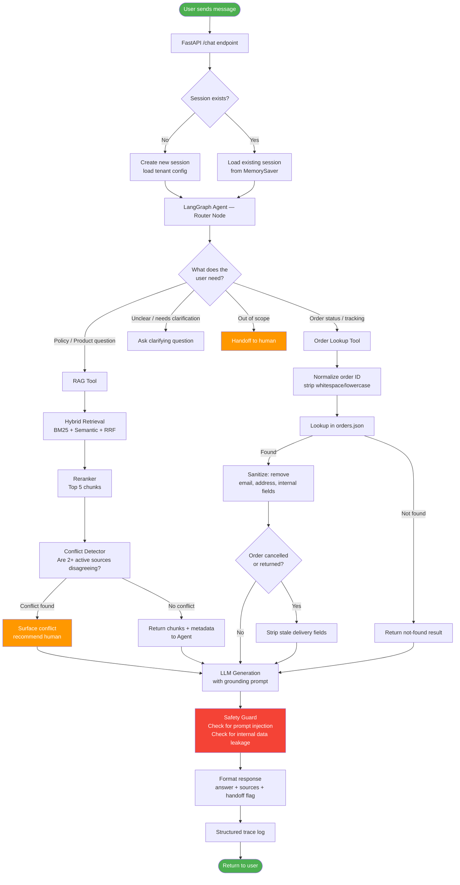
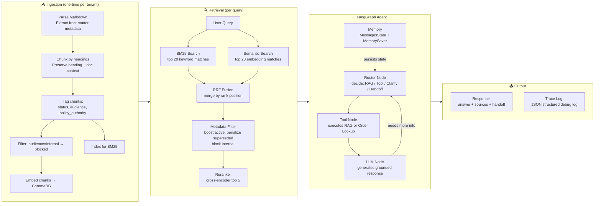

# Architecture — Universal RAG Support Agent

> **Design Principle:** Built generic first. Aster & Row is the *default tenant*.
> Any brand can plug in their own knowledge base, order data, and config — zero code changes.

---

## The Big Picture (What We're Building)

```
┌─────────────────────────────────────────────────────────────┐
│                        USER / CLIENT                        │
│              (browser chat UI or API caller)                │
└────────────────────────────┬────────────────────────────────┘
                             │ HTTP POST /chat
                             ▼
┌─────────────────────────────────────────────────────────────┐
│                      FastAPI Server                         │
│  • Receives {message, session_id, tenant_id}                │
│  • Routes to the correct tenant's agent                     │
└────────────────────────────┬────────────────────────────────┘
                             │
                             ▼
┌─────────────────────────────────────────────────────────────┐
│                    LangGraph Agent Loop                     │
│                                                             │
│   ┌──────────┐    ┌──────────────┐    ┌─────────────────┐  │
│   │  Router  │───▶│ Tool / RAG   │───▶│  LLM + Grounding│  │
│   │  Node    │    │  Execution   │    │  + Safety Guard  │  │
│   └──────────┘    └──────────────┘    └─────────────────┘  │
│         ▲                                      │            │
│         └──────────────── loop ────────────────┘            │
│                                                             │
│   State: {messages, session_id, tenant_id, trace}           │
└─────────────────────────────────────────────────────────────┘
                             │
              ┌──────────────┴──────────────┐
              ▼                             ▼
┌─────────────────────┐       ┌─────────────────────────────┐
│   RAG Pipeline      │       │   Order Lookup Tool          │
│                     │       │                             │
│  ChromaDB           │       │  orders.json (per tenant)   │
│  (per tenant)       │       │  → sanitize → return only   │
│  + BM25 + Reranker  │       │    safe fields              │
└─────────────────────┘       └─────────────────────────────┘
              │
              ▼
┌─────────────────────┐
│  Structured Logger  │
│  logs/{session}.json│
└─────────────────────┘
```

---

## Multi-Tenant Design (Pluggable Architecture)

Each tenant (brand) gets its own isolated config folder:

```
tenants/
├── aster-and-row/          ← default tenant (this assignment)
│   ├── tenant.yaml         ← brand config, LLM settings, persona
│   ├── knowledge-base/     ← markdown documents
│   └── data/
│       └── orders.json     ← order data
│
└── acme-brand/             ← any future brand just drops files here
    ├── tenant.yaml
    ├── knowledge-base/
    └── data/
        └── orders.json
```

> **To add a new brand:** create a folder under `tenants/`, write a `tenant.yaml`, drop in docs and order data. Run `python ingest.py --tenant acme-brand`. Done.

---

## Full System Flow — Step by Step



---

## Component Map — Who Does What



---

## File Structure — What Goes Where

```
project/                        ← all project code
│
├── main.py                     ← FastAPI app, /chat endpoint, structured tracer
│
├── ingest.py                   ← CLI: python ingest.py --tenant <name>
│
├── src/
│   ├── agent.py                ← LangGraph graph, node handlers, AgentRunner
│   ├── knowledge.py            ← HybridRetriever (BM25 + ChromaDB + RRF + reranker)
│   ├── tools.py                ← OrderLookupTool (normalize → sanitize → safe result)
│   └── core.py                 ← settings, RequestTrace, StructuredTracer
│
├── tenants/                    ← one folder per brand (multi-tenant)
│   └── aster-and-row/
│       ├── tenant.yaml         ← brand name, persona, LLM model
│       ├── knowledge-base/     ← 14 markdown policy/product documents
│       └── data/
│           └── orders.json     ← order data (never sent to LLM directly)
│
├── evaluation/
│   ├── run_eval.py             ← entry point: python evaluation/run_eval.py
│   ├── assertions.py           ← 12 deterministic assertion functions
│   └── cases/
│       ├── visible-cases.json  ← 10 provided test cases
│       └── custom-cases.json   ← 10 original additional cases
│
├── static/
│   └── index.html              ← single-file chat UI
│
├── logs/                       ← auto-created JSONL structured trace logs
│
├── chroma_db/                  ← auto-created vector store (per-tenant)
│
├── .env.example                ← required env vars template
├── requirements.txt
└── README.md
```

---

## Implementation Plan — Build Order

> Build in this exact order. Each step is independently testable.

### Phase 1 — Foundation (Config + Ingestion)
```
Step 1: Project scaffold (folders, requirements.txt, .env.example)
Step 2: Tenant config loader (tenant.yaml → Python dataclass)
Step 3: Markdown parser (front matter → metadata dict)
Step 4: Chunker (split by heading, attach metadata to each chunk)
Step 5: Embedder (embed chunks → store in ChromaDB with metadata)
Step 6: BM25 index builder (rank index from same chunks)
Step 7: ingest.py CLI (python ingest.py --tenant aster-and-row)

✓ Test: can index docs, can query ChromaDB directly
```

### Phase 2 — Retrieval Pipeline
```
Step 8:  Semantic search (ChromaDB query → top 20)
Step 9:  BM25 search (keyword query → top 20)
Step 10: RRF fusion (merge by rank → deduplicated list)
Step 11: Metadata filter (boost active, penalize superseded, block internal)
Step 12: Reranker (cross-encoder → top 5)
Step 13: Conflict detector (2+ active sources with contradictory info?)

✓ Test: query "return window" → gets doc 01, NOT doc 02 or 14
```

### Phase 3 — Order Lookup Tool
```
Step 14: Load orders.json (per tenant path)
Step 15: Normalize input (strip, uppercase, validate format)
Step 16: Lookup by order_id
Step 17: Sanitizer (strip forbidden fields, strip stale delivery if cancelled)
Step 18: Return typed result dict

✓ Test: ORD-1004 (cancelled) → no ETA, ORD-9999 → not found
```

### Phase 4 — LangGraph Agent
```
Step 19: AgentState definition (messages, session_id, tenant_id, trace)
Step 20: LLM node (calls LLM with grounding prompt + retrieved context)
Step 21: Router node (decides: RAG / order / clarify / handoff)
Step 22: Tool node (executes RAG tool or order tool)
Step 23: Safety guard (prompt injection check, internal data check)
Step 24: Graph wiring (nodes + edges + conditional routing)
Step 25: MemorySaver (per thread_id session memory)

✓ Test: multi-turn Canada question works, context preserved
```

### Phase 5 — API + UI
```
Step 26: FastAPI /chat endpoint (accepts message, session_id, tenant_id)
Step 27: Response schema (answer, sources, handoff_recommended)
Step 28: Single-file HTML chat UI (fetch /chat, display response + sources)
Step 29: Debug mode toggle (DEBUG=true → attach trace to response)

✓ Test: full end-to-end conversation in browser
```

### Phase 6 — Evaluation Suite
```
Step 30: Assertion library (must_include, must_not_include, source check, tool check, privacy check)
Step 31: Load + run visible-cases.json
Step 32: Add 5+ custom cases (custom-cases.json)
Step 33: Per-case result report + category summary
Step 34: run_eval.py entry point (one command)

✓ Test: python evaluation/run_eval.py → all 15+ cases reported
```

### Phase 7 — Observability + Polish
```
Step 35: Structured JSON trace logger (every request)
Step 36: README.md (setup, arch, eval results, bug diary)
Step 37: Bug diary (3+ documented failures with root cause + fix)
Step 38: .env.example
Step 39: Demo GIF/video
```

---

## Key Design Decisions (and Why)

| Decision | Choice | Why |
|---|---|---|
| Orchestration | LangGraph | Stateful graph = reliable multi-turn + tool routing |
| Vector store | ChromaDB | Local, metadata filtering built-in, zero infra |
| Retrieval | Hybrid BM25 + Semantic | BM25 catches order IDs/exact terms, semantic catches intent |
| Fusion | RRF | Score-scale-independent merging — industry standard |
| Reranker | Token-overlap + authority scoring | Sub-10ms latency, no GPU dependency |
| Memory | MemorySaver per thread_id | Zero infra, per-session isolated context |
| Multi-tenancy | Folder-per-tenant + tenant.yaml | Drop-in new brand, no code changes |
| Internal doc block | Metadata filter at ingestion | `audience: internal` → never enters retrieval |
| Privacy | Sanitizer in tool, not in prompt | LLM never sees forbidden fields at all |
| Evaluation | Deterministic assertions only | 12 check types; no LLM grading — fully reproducible |
| LLM model | gemini-3.6-flash → gemini-3.5-flash-lite | Cascading fallback on model API deprecation |
| Conflict handling | Prompt injection when has_conflict=True | Explicitly instructs LLM to surface conflict, not pick one |
| Handoff detection | Post-response signal parsing | LLM decides; we extract the structured bool from its own words |
| Observability | conversation_history in every trace | Full prior-turn context captured per README requirement |

---

## How Multi-Tenancy Works (Simple Mental Model)

```
Same code, different data folders.

Brand A (Aster & Row):
  tenant_id = "aster-and-row"
  ChromaDB collection = "aster-and-row"
  orders.json = tenants/aster-and-row/data/orders.json
  persona = "You are Aster & Row support..."

Brand B (Acme):
  tenant_id = "acme-brand"
  ChromaDB collection = "acme-brand"
  orders.json = tenants/acme-brand/data/orders.json
  persona = "You are Acme support..."

Zero code changes. Just config + data.
```

---

## What We Are NOT Building (Scope Guard)

- ❌ Auth / login
- ❌ Production vector DB (Pinecone, Weaviate)
- ❌ Fine-tuning
- ❌ React / Next.js frontend
- ❌ Billing / analytics
- ❌ Multiple LLM providers (one is enough)
